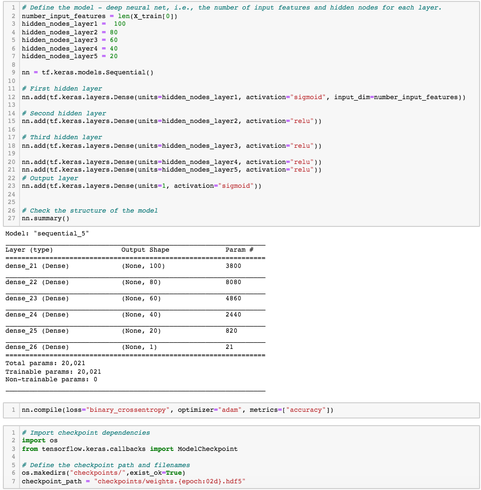
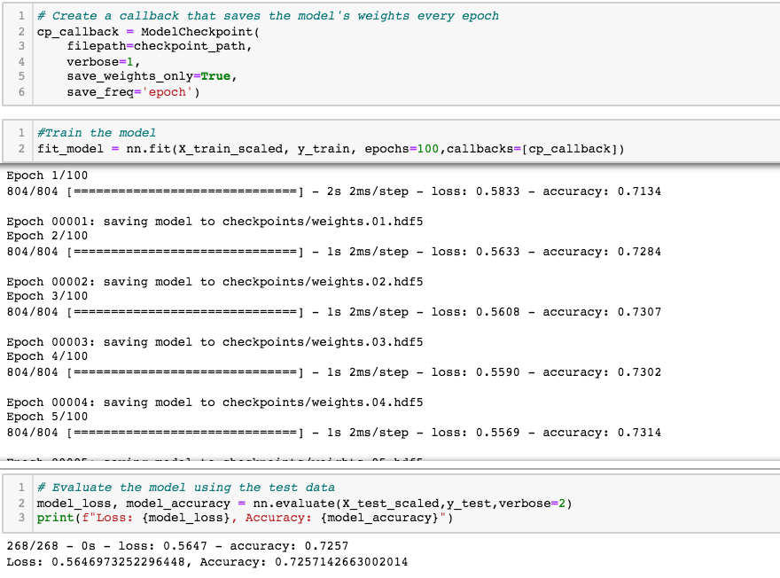

# Neural Network Charity Analysis
## Project Overview 
The purpose of this analysis is to create a binary classifier that is capable of predicting whether applicants will be successful if funded by Alphabet Soup Co. We will use a Neural Network model to help Alphabet Soup's busniess team predict where they should make their investments. This project will follow the following steps: 

1. Preprocess Data for a Neural Network Model
2. Compile, Train, and Evaluate the Model
3. Optimize the Model

## Results 
### Data Preprocessing 
- The IS_SUCCESSFUL column is considered the target of our model. 
- The APPLICATION_TYPE, AFFILIATION, CLASSIFICATION, USE_CASE, ORGANIZATION, INCOME_AMT, and ASK_AMT variables are the features of our model. 
- Lastly, the EIN, NAME, STATUS, and SPECIAL_CONSIDERATIONS varaibles are neither targets nor features and should be dropped from the input data of the model. They are irrelevant to the analysis. 

### Compiling, Training, and Evaluating the Model
- I selected 5 layers overall. The first layer contained 100 neurons with a sigmoid activator, the second layer contained 80 neurons with a relu acivator, the thrid layer contained 60 neurons with a relu activator, the fourth layer contained 40 neurons with a relu activator, and lastly the fifth layer contained 20 neurons with a relu activator as well. I changed the activation function for the first layer becasue it yielded a higher accuracy score for the model. 
- Model only produced a 72% accuracy score, so I was unable to achieve the target model performance. 
- To try and increase the performace score, I tried a few things: 
	- dropping more columns 
	- changing the number of values in each bin 
	- adding more hidden layers
	- adding/subtracting neurons in each layer 
	- using different activation functions 

## Summary 
Overall, by removing irrelevant variables, adding hidden layers and neurons, and changing activation functions, the deep learning model gave a 72% accuracy score for predicting if an applicant's donation is succesful. While we didn't meet our 75% accuracy target, the model still gave Alphabet Soup Co. insight as to where they should make their investments based off the predictions. 

For an alternative method, I recommend using a Random Forest Classifier model to solve the binary classification problem. The randon forest model crates a number of decision trees from a random subset of the data and then takes the average from all to improve the overall prediction accuracy of the dataset. This model is robust and maintains accuracy on large sets of data due to that fact that it will handle missing values and solves the issue of overfitting. 